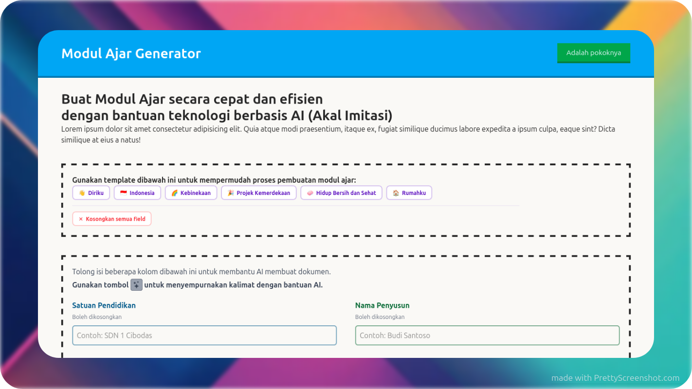

<a id="readme-top"></a>

[![Contributors][contributors-shield]][contributors-url]
[![Forks][forks-shield]][forks-url]
[![Stargazers][stars-shield]][stars-url]
[![Issues][issues-shield]][issues-url]
[![UnlicenseLicense][license-shield]][license-url]
[![LinkedIn][linkedin-shield]][linkedin-url]

<!--PROJECTLOGO-->
<br />
<div align="center">
  <a href="https://github.com/NgodingWok/modul-ajar-generator">
    
  </a>

  <h3 align="center">Modul Ajar Generator</h3>

  <p align="center">
    Aplikasi web berbasis AI untuk membantu guru menyusun modul ajar dengan cepat dan efisien.
    <br />
    <a href="docs"><strong>Buka Dokumentassi »</strong></a>
    <br />
    <br />
    <a href="https://www.modul-ajar.web.id">Kunjungi Situs</a>
    &middot;
    <a href="https://github.com/NgodingWok/modul-ajar-generator/issues/new?labels=bug&template=bug-report---.md">Laporkan Bug</a>
    &middot;
    <a href="https://github.com/NgodingWok/modul-ajar-generator/issues/new?labels=enhancement&template=feature-request---.md">Ajukan Fitur</a>
    &middot;
    <a href="https://discord.gg/nA3xMhm5Nk">Gabung Komunitas</a>
  </p>
</div>


<!--ABOUTTHEPROJECT-->
## Tentang Proyek

Aplikasi web berbasis AI yang dirancang untuk mempermudah guru merancang modul ajar (RPP). Aplikasi ini menghemat waktu penyusunan materi dan struktur dokumen, sehingga guru hanya perlu memastikan konten yang dihasilkan sesuai dengan kebutuhan pembelajaran mereka. Dengan antarmuka yang sederhana, guru dapat dengan mudah menghasilkan modul ajar berkualitas tinggi untuk berbagai mata pelajaran dan tingkat pendidikan.

### Latar Belakang

Penyusunan modul ajar secara rutin sering kali menyita banyak waktu dan tenaga para pendidik. Keterbatasan akses referensi dan keragaman tingkat keterampilan komputer menjadikan tugas ini cukup menantang. Aplikasi ini lahir dari kebutuhan nyata untuk memberikan solusi praktis berbasis AI guna menyelesaikan masalah tersebut dengan cepat dan efisien.

<p align="right">(<a href="#readme-top">Kembali ke Atas</a>)</p>


## Teknologi yang Digunakan

Proyek web ini dibangun menggunakan alat dan teknologi relevan, di antaranya:

* [![EJS][EJS.co]][EJS-url]
* [![Express][Express.js]][Express-url]
* [![TailwindCSS][Tailwindcss.com]][Tailwindcss-url]
* [![OpenAIAPI][OpenAI.com]][OpenAI-url]

> [!NOTE]
> Kenapa menggunakan teknologi ini? Kenapa tidak memakai teknologi lain? Ya karena buat ngepres budget wkwk, tapi tenang aja, teknologi yang dipilih sudah cukup mumpuni untuk kebutuhan proyek ini kok.

<p align="right">(<a href="#readme-top">Kembali ke Atas</a>)</p>


<!--GETTINGSTARTED-->
## Memulai

Bila Anda ingin mencoba menjalankan proyek ini secara lokal, silakan ikuti petunjuk ringkas berikut:

### Prasyarat

Pastikan Anda telah memasang minimum perangkat lunak berikut dalam sistem:
* [Node.js v18+](https://nodejs.org/)

### Instalasi

1. Klon repositori:
   ```sh
   git clone https://github.com/NgodingWok/modul-ajar-generator.git
   ```
2. Pindah ke dalam direktori kerja:
   ```sh
   cd modul-ajar-generator
   ```
3. Instal seluruh dependensi rujukan:
   ```sh
   npm install
   ```
4. Salin file templat konfigurasi lingkungan (`.env.example` menjadi `.env`) lalu isikan kredensial (termasuk `OPENAI_API_KEY`) yang sesuai:
   ```sh
   cp .env.example .env
   ```
5. (Opsional) Kompilasi bundel aset *TailwindCSS*:
   ```sh
   npm run build:tailwindcss
   ```
6. Jalankan *server* pada mode *development*:
   ```sh
   npm run dev
   ```
7. Kunjungi aplikasi web melalui `http://localhost:3000` di dalam klien peramban Anda.

<p align="right">(<a href="#readme-top">Kembali ke Atas</a>)</p>


<!--CONTRIBUTING-->
## Kontribusi

Setiap tambahan dan perbaikan dari para kontributor dalam proyek _open source_ ini sangat kami hargai.

1. Lakukan _Fork_ pada Repositori ini
2. Buat _Branch_ terisolasi untuk penyesuaian Anda (`git checkout -b feature/FiturBaruAnda`)
3. Setorkan perubahannya (_Commit_) (`git commit -m 'feat: tambah FiturBaruAnda'`)
4. Angkat ke Repository (_Push_) di rute Anda (`git push origin feature/FiturBaruAnda`)
5. Buka usulan penyatuan secara publik (_Pull Request_)

> [!IMPORTANT]
> Jangan lupa untuk memperbarui dokumentasi dengan cara menjalankan `npm run docs` setelah melakukan perubahan pada kode yang mempengaruhi dokumentasi, serta jalankan `npm run test` untuk memastikan kualitas kode sebelum melakukan _Pull Request_.

### Daftar Kontributor Utama:

Orang-orang hebat yang telah memberikan kontribusi signifikan untuk proyek ini:

<a href="https://github.com/NgodingWok/modul-ajar-generator/graphs/contributors">
  
</a>

<p align="right">(<a href="#readme-top">Kembali ke Atas</a>)</p>


<!--LICENSE-->
## Lisensi

Didistribusikan di bawah lisensi Attribution-NonCommercial 4.0 International. Harap tinjau `LICENSE.md` di bilik rujukan file untuk penjelasan mendetail.

<p align="right">(<a href="#readme-top">Kembali ke Atas</a>)</p>

<!--CONTACT-->
## Kontak

Temukan kami:

Tautan Proyek Utama: [https://github.com/NgodingWok/modul-ajar-generator](https://github.com/NgodingWok/modul-ajar-generator)

<p align="right">(<a href="#readme-top">Kembali ke Atas</a>)</p>

<!--ACKNOWLEDGMENTS-->
## Ucapan Terima Kasih

Banyak terima kasih khususnya untuk basis referensi unggulan berikut yang memberi sumbangsih operasional proyek ini:

* [Express.js](https://expressjs.com)
* [Tailwind CSS](https://tailwindcss.com)
* [docx (JavaScript library)](https://docx.js.org/)
* [OpenAI Node/JS SDK API](https://github.com/openai/openai-node)
* [Img Shields](https://shields.io)

<p align="right">(<a href="#readme-top">Kembali ke Atas</a>)</p>

<!--MARKDOWNLINKS&IMAGES-->
[contributors-shield]: https://img.shields.io/github/contributors/NgodingWok/modul-ajar-generator.svg?style=for-the-badge
[contributors-url]: https://github.com/NgodingWok/modul-ajar-generator/graphs/contributors
[forks-shield]: https://img.shields.io/github/forks/NgodingWok/modul-ajar-generator.svg?style=for-the-badge
[forks-url]: https://github.com/NgodingWok/modul-ajar-generator/network/members
[stars-shield]: https://img.shields.io/github/stars/NgodingWok/modul-ajar-generator.svg?style=for-the-badge
[stars-url]: https://github.com/NgodingWok/modul-ajar-generator/stargazers
[issues-shield]: https://img.shields.io/github/issues/NgodingWok/modul-ajar-generator.svg?style=for-the-badge
[issues-url]: https://github.com/NgodingWok/modul-ajar-generator/issues
[license-shield]: https://img.shields.io/github/license/NgodingWok/modul-ajar-generator.svg?style=for-the-badge
[license-url]: https://github.com/NgodingWok/modul-ajar-generator/blob/main/LICENSE.md
[linkedin-shield]: https://img.shields.io/badge/-LinkedIn-black.svg?style=for-the-badge&logo=linkedin&colorB=555
[linkedin-url]: https://www.linkedin.com/in/rafie-hasannudin-76aa3535a
[product-screenshot]: images/screenshot.png

<!--MARKDOWNLINKS-->
[EJS-url]: https://ejs.co/
[Express-url]: https://expressjs.com/
[Tailwindcss-url]: https://tailwindcss.com/
[NodeJS-url]: https://nodejs.org/
[OpenAI-url]: https://openai.com/

<!--MARKDOWNBADGES-->
[EJS.co]: https://img.shields.io/badge/EJS-000000?style=for-the-badge&logo=ejs&logoColor=white
[Express.js]: https://img.shields.io/badge/Express.js-000000?style=for-the-badge&logo=express&logoColor=white
[Tailwindcss.com]: https://img.shields.io/badge/Tailwind_CSS-06B6D4?style=for-the-badge&logo=tailwind-css&logoColor=white
[OpenAI.com]: https://img.shields.io/badge/OpenAI-412991?style=for-the-badge&logo=openai&logoColor=white
